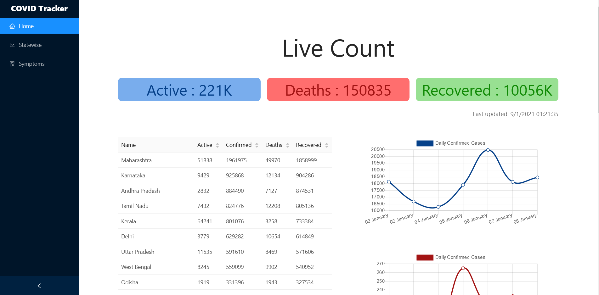
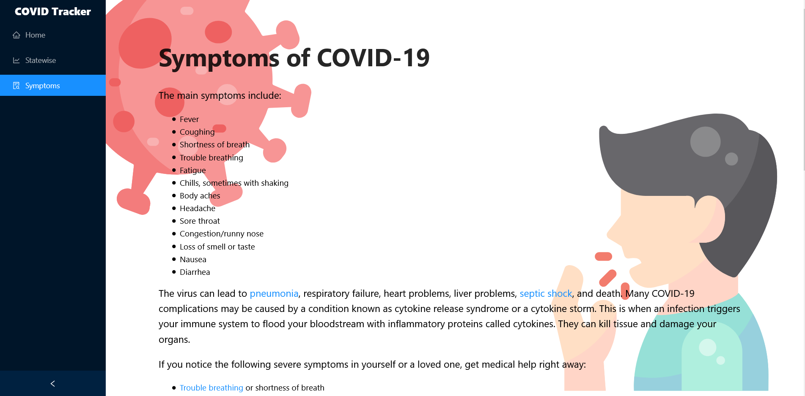
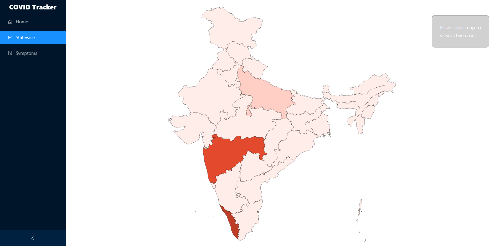

This project was bootstrapped with [Create React App](https://github.com/facebook/create-react-app).

# COVID-19 Tracker

In the project directory, you can run:

### `npm start`

Runs the app in the development mode. 
Open [http://localhost:3000](http://localhost:3000) to view it in the browser.

The page will reload if you make edits. 
You will also see any lint errors in the console.

## What it does?
This is a vey simple web app that shows you the current covid-19 stats across all the states in India. 
Thats it!

### Live link: https://cv19track.herokuapp.com/

